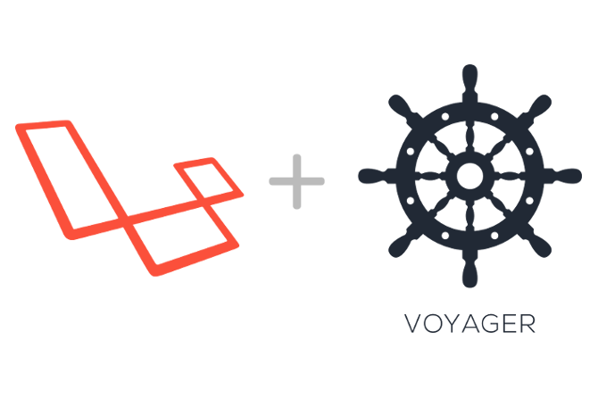

<p align="center"></p>

<p align="center">
<a href="https://travis-ci.org/laravel/framework"></a>
<a href="https://packagist.org/packages/laravel/framework"></a>
<a href="https://packagist.org/packages/laravel/framework"></a>
<a href="https://packagist.org/packages/laravel/framework"></a>
</p>

## About Voyager

Voyager is a Laravel Admin Package that includes BREAD(CRUD) operations, a media manager, menu builder, and much more.

## Requirements

#### Composer

Dependency Manager for PHP. [download](https://getcomposer.org/download/)

## Installation


```sh

# clone the project repo to your local machine

git clone https://github.com/oubihis/Start-Bootstrap.git

# cd'ing to project directory

cd Start-Bootstrap

# install using composer

composer install

```

## Usage

```sh

# cd'ing to project directory

cd pinsdash

# make sur you have .env file
# if not rename .env.example file to .env by executing this command

cp .env.example .env

# fill database credentials
# feel free to adapt to your needs

DB_HOST=localhost
DB_DATABASE=homestead
DB_USERNAME=homestead
DB_PASSWORD=secret

# you will also want to update your website URL inside of the APP_URL variable inside the .env file:

APP_URL=localhost:8000

# contains 1 default admin accounts
# 
# 'email' 		=> 'admin@admin.com',
# 'password'    => 'password'

# if you wish to create a new admin user you can pass the --create flag, like so:
php artisan voyager:admin your@email.com --create

# then
php artisan migrate:fresh --seed


# local development server
# this command will start a development server at http://localhost:8000:

php artisan serve

```


## License

The Laravel framework is open-source software licensed under the [MIT license](https://opensource.org/licenses/MIT).
"# Start-Bootstrap" 
